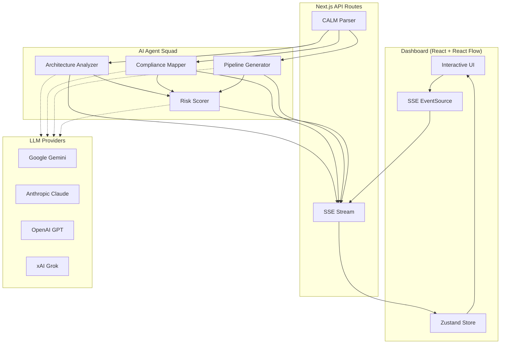

<p align="center">
  
</p>

<h1 align="center">CALMGuard</h1>

<p align="center">
  <strong>From Architecture-as-Code to Continuous Compliance — Automatically.</strong>
</p>

<p align="center">
  <a href="https://github.com/finos-labs/dtcch-2026-opsflow-llc/actions/workflows/ci.yml"></a>
  <a href="https://github.com/finos-labs/dtcch-2026-opsflow-llc/actions/workflows/semgrep.yml"></a>
  <a href="LICENSE"></a>
  
  
  
  
</p>

---

CALMGuard is a **CALM-native continuous compliance DevSecOps platform**. Describe your architecture using the [FINOS CALM](https://github.com/finos/architecture-as-code) standard, and CALMGuard deploys a squad of AI agents to analyze compliance gaps, score risk, and generate production-ready CI/CD pipelines — all streamed in real-time to an interactive dashboard.

Built for the **DTCC/FINOS Innovate.DTCC AI Hackathon** (Feb 23–27, 2026).

## Key Features

| CALM Parser | AI Agent Squad | Real-Time Dashboard | Pipeline Generator |
|:-----------:|:--------------:|:-------------------:|:------------------:|
| Full CALM 1.1 schema support with Zod validation | 4 specialized agents: Analyzer, Compliance Mapper, Risk Scorer, Pipeline Gen | React Flow architecture graphs with touring camera animation | GitHub Actions, security scanning, IaC configs |
| Nodes, relationships, flows, interfaces, controls | Multi-provider LLM: Gemini, Claude, GPT, Grok | Live SSE streaming with agent status indicators | SAST, dependency audit, license compliance |
| Demo architectures included | Parallel Phase 1 + sequential Phase 2 orchestration | Compliance gauges, risk heat maps, exportable reports | Automated from your architecture definition |

## How It Works

```
┌─────────────┐     ┌──────────────────┐     ┌─────────────────┐
│  1. Upload   │────▶│   2. Analyze      │────▶│    3. Act        │
│  CALM JSON   │     │   AI Agent Squad  │     │  Pipelines +     │
│              │     │   scores & maps   │     │  Compliance Report│
└─────────────┘     └──────────────────┘     └─────────────────┘
```

1. **Upload** a CALM architecture JSON (or use built-in demos: Payment Gateway, Trading Platform)
2. **Analyze** — four AI agents run in parallel to assess compliance, map controls, score risks
3. **Act** — get generated CI/CD pipelines, security configs, and a full compliance report

## Quick Start

### Prerequisites

- **Node.js 22+** and **pnpm 9+**
- At least one LLM provider API key (Gemini is the default)

### Setup

```bash
git clone https://github.com/finos-labs/dtcch-2026-opsflow-llc.git
cd dtcch-2026-opsflow-llc
pnpm install
```

Create a `.env` file:

```bash
# Required: at least one provider
GOOGLE_GENERATIVE_AI_API_KEY=your-gemini-key

# Optional: additional providers
ANTHROPIC_API_KEY=your-claude-key
OPENAI_API_KEY=your-openai-key
XAI_API_KEY=your-grok-key
```

### Run

```bash
pnpm dev          # Start dev server at http://localhost:3000
```

Visit the dashboard — click **"Demo Mode"** to see CALMGuard analyze a sample architecture without any API keys.

## Architecture



## Tech Stack

| Layer | Technology | Purpose |
|-------|-----------|---------|
| **Framework** | Next.js 15 (App Router) | Full-stack React with API routes |
| **Language** | TypeScript (strict) | Type-safe codebase, zero `any` |
| **AI** | Vercel AI SDK | Structured output via `generateObject` + Zod |
| **LLM Providers** | Gemini, Claude, GPT, Grok | Multi-provider with configurable default |
| **CALM** | @finos/calm-cli v1.33 | FINOS Architecture-as-Code integration |
| **Visualization** | React Flow + Recharts | Interactive architecture graphs + compliance charts |
| **State** | Zustand | Single store, SSE-driven updates |
| **UI** | shadcn/ui + Tailwind CSS | Dark theme, accessible components |
| **Validation** | Zod | Runtime schema validation for all data boundaries |
| **Streaming** | Server-Sent Events | Real-time agent event delivery |

## Agent System

CALMGuard runs a coordinated squad of four AI agents, defined as YAML configurations in [`agents/`](agents/):

| Agent | Role | Output |
|-------|------|--------|
| **Architecture Analyzer** | Evaluates architecture quality, identifies patterns and anti-patterns | Architecture assessment with severity-scored findings |
| **Compliance Mapper** | Maps CALM controls to regulatory frameworks | Control-to-framework mapping with gap analysis |
| **Pipeline Generator** | Generates CI/CD and security scanning configs | GitHub Actions YAML, SAST/DAST configs, IaC |
| **Risk Scorer** | Aggregates findings into overall risk score | Weighted risk scores with heat map data |

**Orchestration:** Phase 1 runs Analyzer + Mapper + Pipeline Gen in parallel. Phase 2 runs Risk Scorer on aggregated results.

## Compliance Frameworks

CALMGuard ships with deep knowledge of four compliance frameworks as [skill files](skills/):

- **NIST Cybersecurity Framework (CSF)** — 23.4 KB of mappable controls
- **PCI DSS** — Payment card industry security standards
- **SOX** — Financial reporting and audit requirements
- **FINOS Common Cloud Controls (CCC)** — Cloud-native security controls

## Demo Architectures

Two production-realistic CALM architectures are included in [`examples/`](examples/):

| Architecture | Description |
|-------------|-------------|
| **Payment Gateway** | Multi-service payment processing with encryption, tokenization, PCI controls |
| **Trading Platform** | Real-time trading system with market data feeds, order management, risk engine |

## Documentation

Full documentation is included in the [`docs/`](docs/) directory, built with [Docusaurus](https://docusaurus.io/):

- Getting Started guide
- Architecture deep-dive
- Agent system reference
- API documentation
- Compliance framework details

Run locally with `pnpm docs:dev`.

## Contributing

We welcome contributions! See [CONTRIBUTING.md](.github/CONTRIBUTING.md) for:

- Development setup and workflow
- Branch naming and commit conventions (Conventional Commits)
- CI pipeline requirements
- Code standards (TypeScript strict, Zod schemas, dark theme)

All commits must include a **DCO sign-off** (`git commit -s`).

## Team

**OpsFlow LLC** — Built for DTCC/FINOS Innovate.DTCC AI Hackathon 2026

| Name | Role |
|------|------|
| **Gourav J. Shah** | Lead Engineer |
| **Anoop Mehendale** | Engineer |

## Hackathon Context

This project was built for the [Innovate.DTCC AI Hackathon](https://innovate.dtcc.com/) (Feb 23–27, 2026), organized by **DTCC** and powered by **FINOS**. The challenge: leverage AI to improve DevSecOps workflows in financial services using the FINOS CALM (Common Architecture Language Model) standard.

CALMGuard demonstrates how **Architecture-as-Code** can be the foundation for automated, continuous compliance — turning static architecture documentation into living, actionable security intelligence.

## License

Copyright 2026 FINOS

Distributed under the [Apache License, Version 2.0](http://www.apache.org/licenses/LICENSE-2.0).

SPDX-License-Identifier: [Apache-2.0](https://spdx.org/licenses/Apache-2.0)

## Acknowledgements

- [**FINOS**](https://www.finos.org/) — Financial Open Source Foundation
- [**CALM**](https://github.com/finos/architecture-as-code) — Common Architecture Language Model
- [**DTCC**](https://www.dtcc.com/) — Depository Trust & Clearing Corporation
- [**Vercel AI SDK**](https://sdk.vercel.ai/) — Structured AI output framework
- [**shadcn/ui**](https://ui.shadcn.com/) — Beautiful accessible components
- [**React Flow**](https://reactflow.dev/) — Interactive graph visualization
